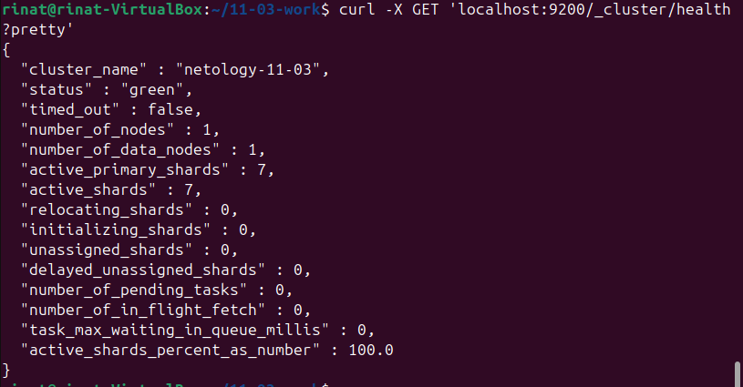
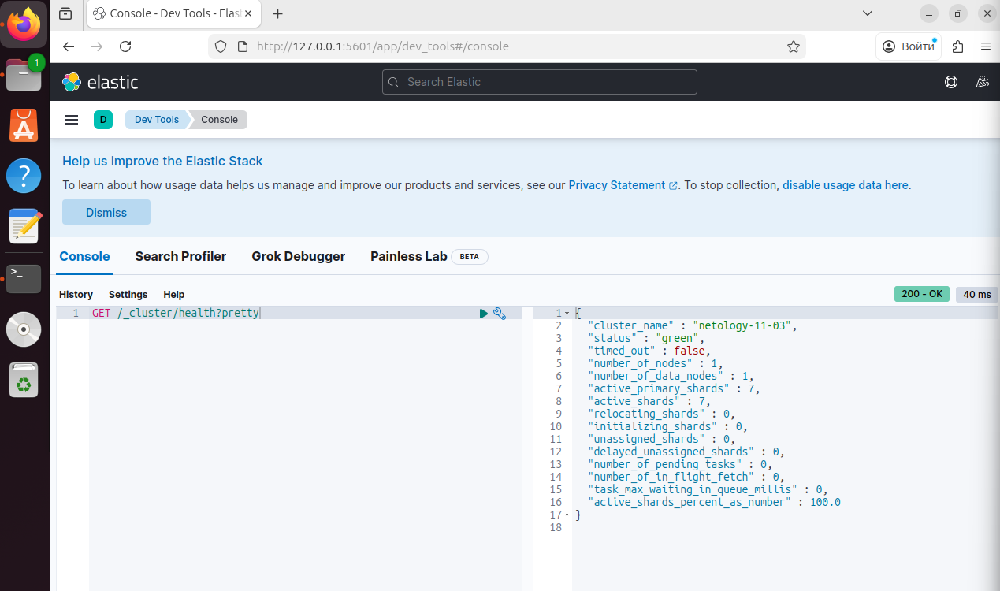
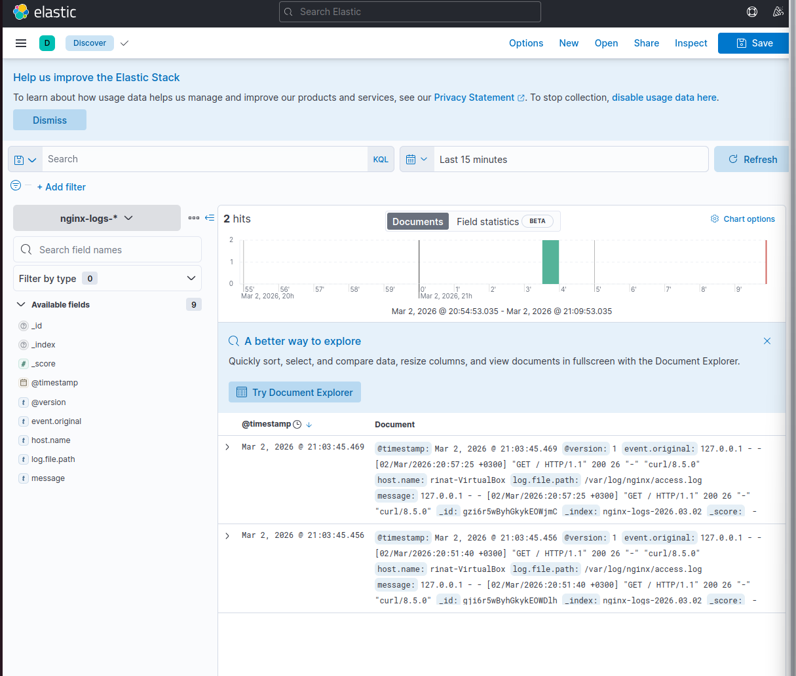

# Домашнее задание к занятию "`ELK`" - `Серкебаев Ринат`

https://github.com/netology-code/sdb-homeworks/blob/main/11-03.md

### Задание 1 

Скриншот команды 'curl -X GET 'localhost:9200/_cluster/health?pretty', сделанной на сервере с установленным Elasticsearch.

Виден нестандартный cluster_name.

### Задание 2

Скриншот интерфейса Kibana на странице http://127.0.0.1:5601/app/dev_tools#/console, где выполнен запрос GET /_cluster/health?pretty.

### Задание 3

Скриншот интерфейса Kibana, на котором видны логи Nginx.

### Задание 4

Скриншоты интерфейса Kibana, на котором видны логи Nginx, которые были отправлены через Filebeat.

